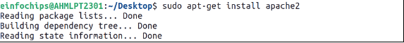
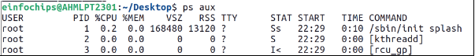

### **Comprehensive Linux Operations**
#### **Project Overview**
This project spans various aspects of Linux system administration, including file management, user and group management, service control, process handling, and more. You will be completing tasks that simulate real-world scenarios, providing hands-on experience with Linux commands and configurations.
### **Project Breakdown**
#### **Part 1: Creating and Editing Text Files (20 minutes)**
**Scenario:** You are tasked with documenting the configurations and settings for a new server. You'll use different text editors to create and update these documents.

**Using Nano**

Create a file server\_config.txt using Nano and Add the Content :

         

Save and exit (Ctrl+O, Enter, Ctrl+X).

**Using Vi**

Edit the same file with Vi and Append the text:

Save and exit (Esc, :wq).

**Using Vim**

Further edit the file with Vim and Append the text:

Save and exit (Esc, :wq).
#### **Part 2: User & Group Management (20 minutes)**
**Scenario:** You need to set up user accounts and groups for a new team joining the project.

We need to use sudo in these commands because user and group management requires root user permissions.

**Adding/Removing Users**

Add a new user developer:

Remove the user developer:

**Managing Groups**

Create a group devteam:

Add the user developer to the devteam group:

**	

**Remove the user developer from the devteam group:**

#### **Part 3: File Permissions Management (20 minutes)**
**Scenario:** Ensure that only the appropriate users have access to specific files and directories.

 **Understanding File Permissions**

Here we view permissions for server\_config.txt:

	

Here rw is for user which means owner has read and write access.

Here rw for second place belongs to group which has read and write 	access.

Here r for third place belongs to others which has read access.

**Changing Permissions and Ownership**

Change permissions to read/write for the owner and read-only for others:

Here 644 means 6 refers to the read write access for the owner .

4 refers to the read only access for group.

4 refers to the read only access for others.

Change the owner to developer and the group to devteam:

#### **Part 4: Controlling Services and Daemons (20 minutes)**

**Scenario:** Manage the web server service to ensure it is running correctly and starts on boot.

We use systemctl command which is responsible for manage services.

**Managing Services with systemctl**

	

Before we start the service we need to install apache first which is illustrate through 	above commands where we first update package list and then install apache2.

Then First we Start the Apache service

Then Stop the Apache service.

Then Enable the Apache service to start on boot.

Then Disable the Apache service.

Then check the status of the Apache service.

**Understanding Daemons**

Discuss the role of the sshd daemon in providing SSH access to the server.

#### **Part 5: Process Handling (20 minutes)**
**Scenario:** Monitor and manage processes to ensure the server is performing optimally.

**Viewing Processes**

List all running processes.

Use top to view processes in real-time.

**Managing Processes**

Identify a process to kill using ps or top, then kill it:

Here we kill firefox.

Here sleep 100 means system pauses for 100 seconds and this & send this 	command for background processing and by using nice command we set the low 	priority which means os provides less cpu time to it.

Here we change priority using renice and +10 means we set priority of process to 10.

The range of priority is -20 (highest) and +19 (lowest).

### **Creating and Deploying a Static Website with Apache2**
#### **Preparation (5 minutes)**
Ensure you have access to a Linux environment (e.g., virtual machines, EC2 instances, or local installations) with sudo privileges.
### **Activity Breakdown**
#### **Part 1: Installing Apache2 (5 minutes)**

This is already shown in Part 4.
#### **Part 2: Creating the Website (10 minutes)**

**Create a New Directory for the Website**

	

Here we need to use sudo to make directory because in web root directory it requires root permission and then we give permission to current user .

**Create HTML File**

**Create CSS File**

**Create JavaScript File**

**Add an Image**

#### **Part 3: Configuring Apache2 to Serve the Website (10 minutes)**
**Create a Virtual Host File**

**Enable the New Virtual Host**

Enable the virtual host configuration:

Disable the default site configuration:

Reload the Apache2 service to apply the changes:

	

**Test the Configuration**

